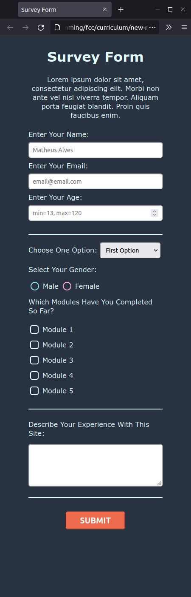
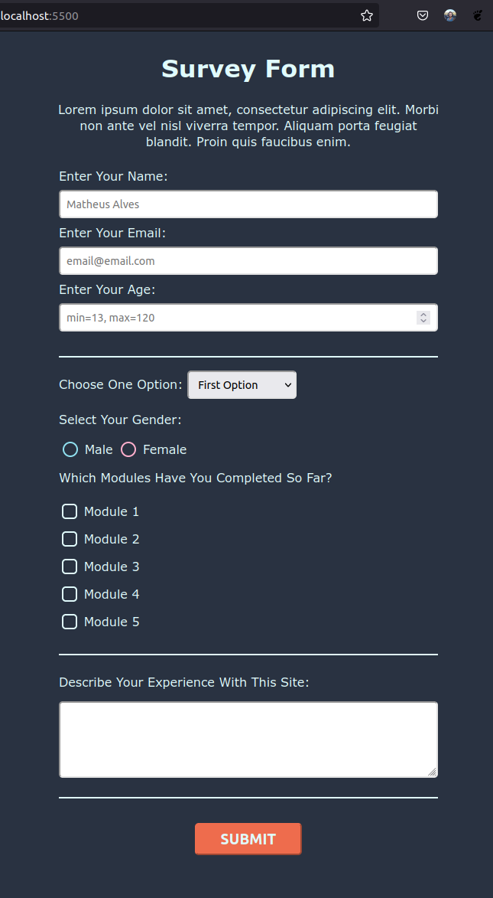

# Survey Form

## Description

This is my solution for the first Certification Project of the FreeCodeCamp's (New) Responsive Web Design Curriculum.

## Screenshots

| Mobile                                                                                                     | Desktop                                                                                                      |
| ---------------------------------------------------------------------------------------------------------- | ------------------------------------------------------------------------------------------------------------ |
|  |  |
